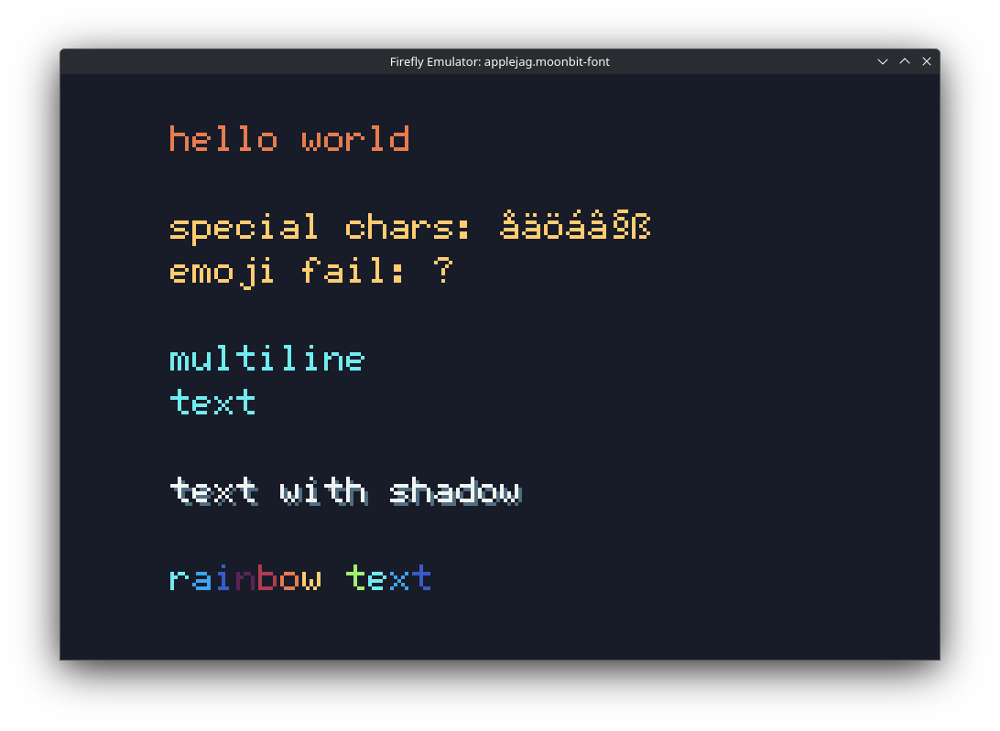
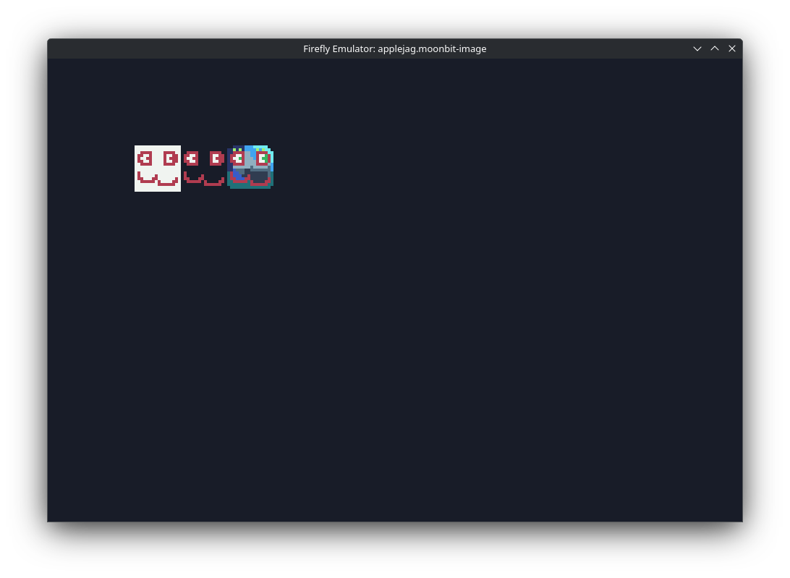
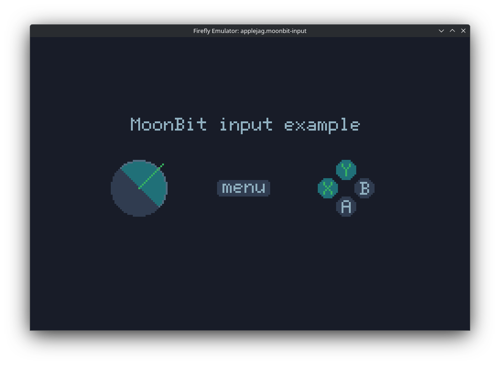
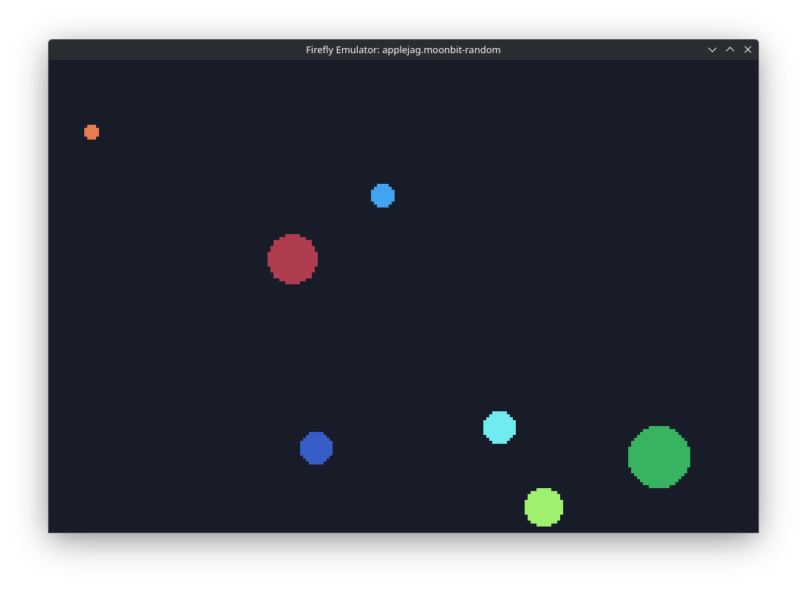
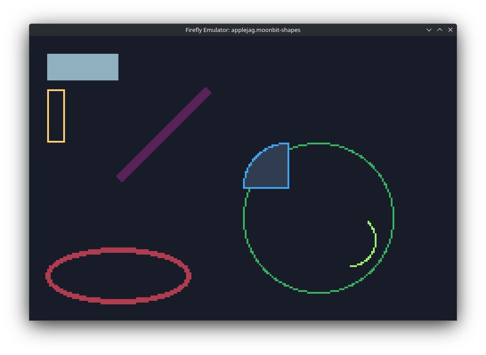

<!--
SPDX-FileCopyrightText: 2025 Kalle Fagerberg

SPDX-License-Identifier: CC0-1.0
-->

# Examples

You need these to run the examples:

- Clone this Git repo: <https://github.com/firefly-zero/firefly-moon>
- MoonBit CLI (`moon`): <https://www.moonbitlang.com/download#moonbit-cli-tools>
- Taskfile CLI (`task`): <https://taskfile.dev/>
- Firefly Zero CLI (`ff`): <https://docs.fireflyzero.com/user/installation/#-cli>
- Firefly Zero emulator (`firefly-emulator`): <https://docs.fireflyzero.com/user/installation/#-emulator>

To run one of the examples then execute the listed command from the root of
this repository.

## Example: [font](./font)

```bash
task example/font:run
```

[](./font)

## Example: [image](./image)

```bash
task example/image:run
```

[](./image)

## Example: [input](./input)

```bash
task example/input:run
```

[](./input)

## Example: [random](./random)

```bash
task example/random:run
```

[](./random)

## Example: [shapes](./shapes)

```bash
task example/shapes:run
```

[](./shapes)

## Example: [sudo](./sudo)

```bash
task example/sudo:run
```

No screenshot. This example only logs things to the console.

```console
DEBUG(app): list_dirs("sys") entries: 6
DEBUG(app):   Dir(name="pub", path="sys/pub")
DEBUG(app):   Dir(name="priv", path="sys/priv")
DEBUG(app):   File(name="config", path="sys/config", size=26)
DEBUG(app):   File(name="new-app", path="sys/new-app", size=22)
DEBUG(app):   File(name="launcher", path="sys/launcher", size=13)
DEBUG(app):   File(name="name", path="sys/name", size=7)
DEBUG(app):
DEBUG(app): list_dirs("roms/firefly/moonbit-sudo") entries: 4
DEBUG(app):   File(name="_meta", path="roms/firefly/moonbit-sudo/_meta", size=56)
DEBUG(app):   File(name="_bin", path="roms/firefly/moonbit-sudo/_bin", size=17064)
DEBUG(app):   File(name="_stats", path="roms/firefly/moonbit-sudo/_stats", size=26)
DEBUG(app):   File(name="_hash", path="roms/firefly/moonbit-sudo/_hash", size=32)
```
