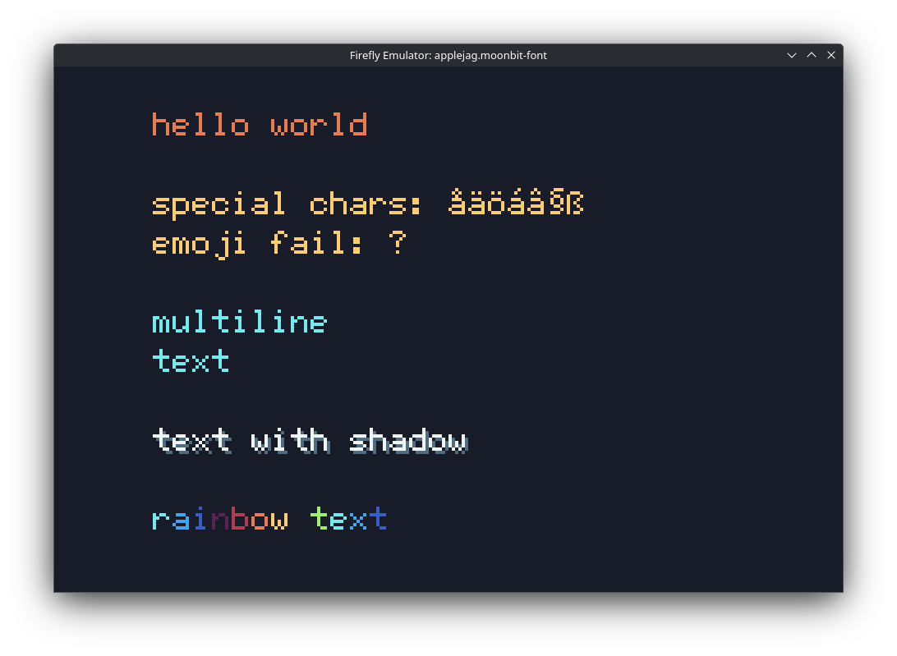
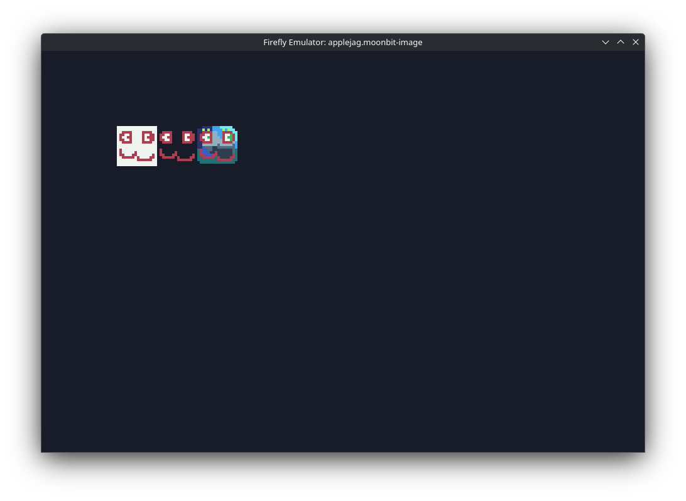
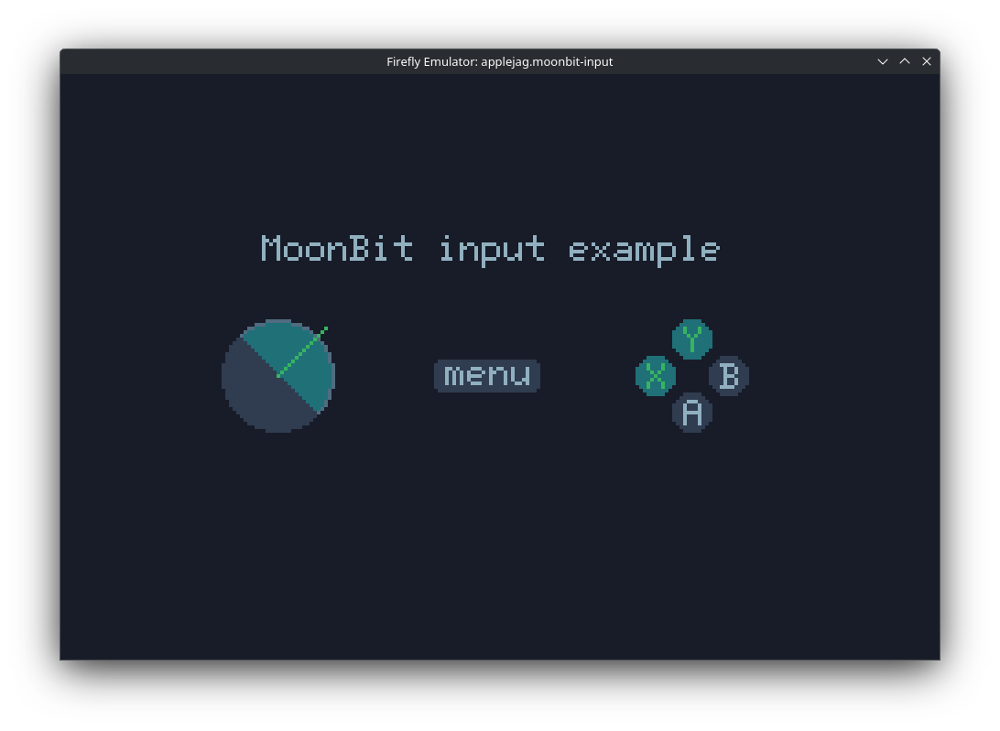
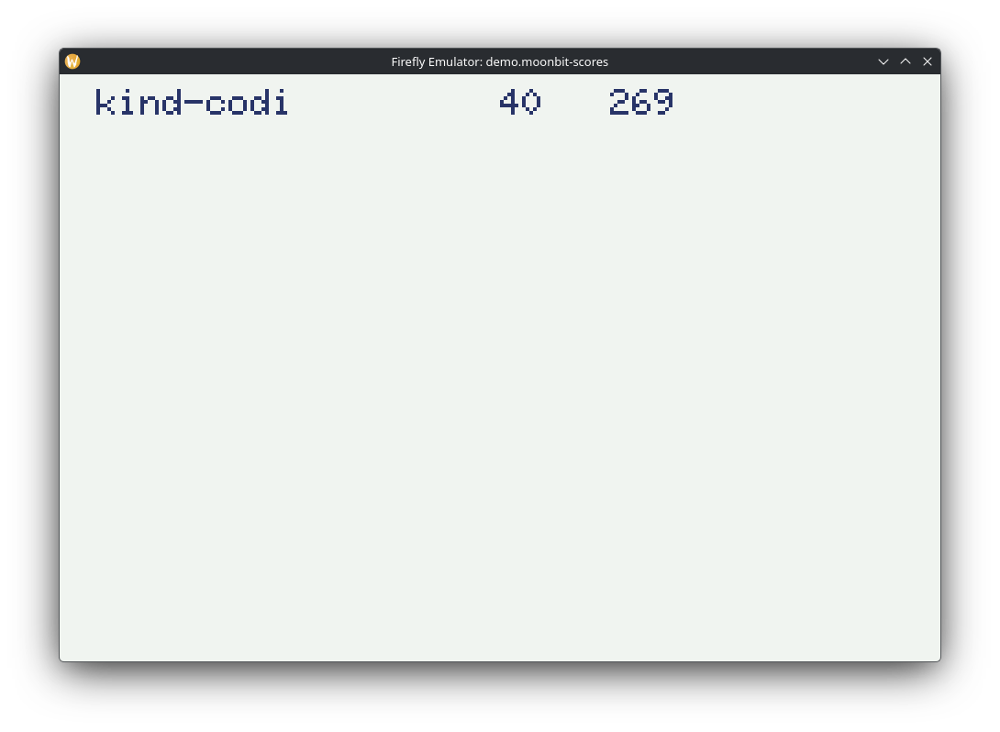
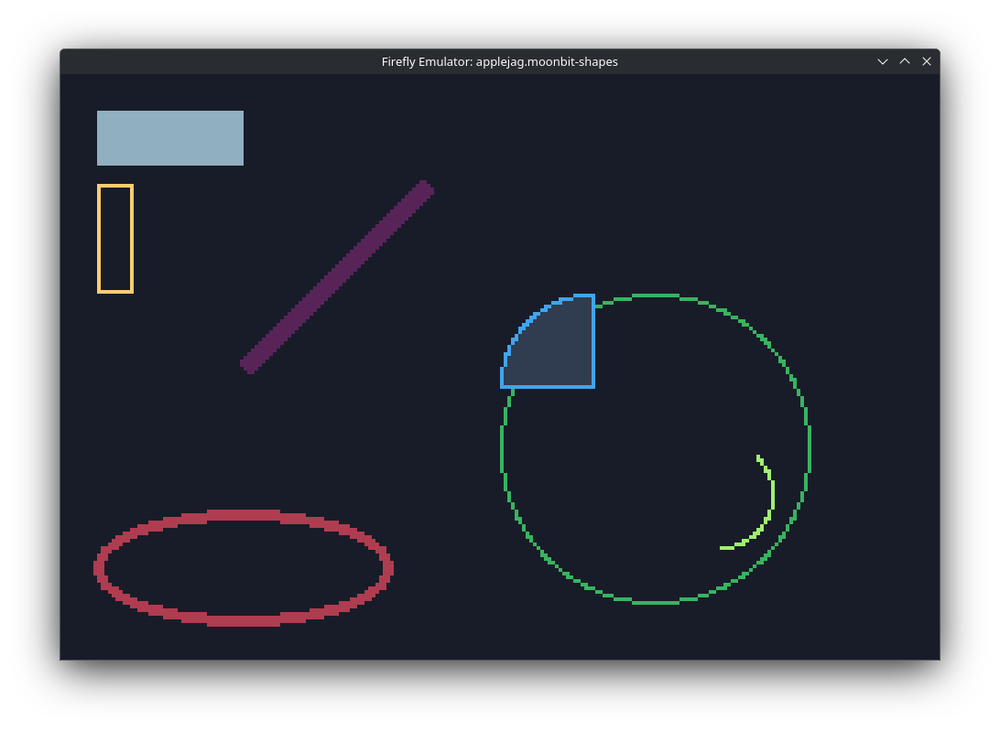

<!--
SPDX-FileCopyrightText: 2025 Kalle Fagerberg

SPDX-License-Identifier: CC0-1.0
-->

# Examples

You need these to run the examples:

- Clone this Git repo: <https://github.com/firefly-zero/firefly-moon>
- MoonBit CLI (`moon`): <https://www.moonbitlang.com/download#moonbit-cli-tools>
- Taskfile CLI (`task`): <https://taskfile.dev/>
- Firefly Zero CLI (`ff`): <https://docs.fireflyzero.com/user/installation/#-cli>
- Firefly Zero emulator (`firefly-emulator`): <https://docs.fireflyzero.com/user/installation/#-emulator>

To run one of the examples then navigate to its directory and run:

```bash
ff build

# replace $NAME with the name shown in the `ff build` output
firefly-emulator --id demo.moonbit-$NAME
```

## Example: [audio](./audio)

> *(no screenshot, it only plays some sounds)*

## Example: [font](./font)

[](./font)

## Example: [image](./image)

[](./image)

## Example: [input](./input)

[](./input)

## Example: [random](./random)

[](./random)

## Example: [scores](./scores)

[](./scores)

## Example: [shapes](./shapes)

[](./shapes)
